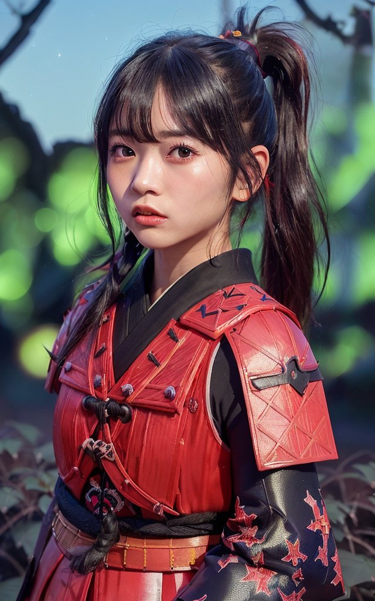
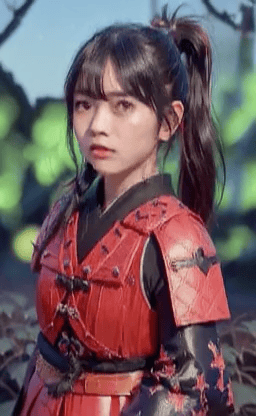
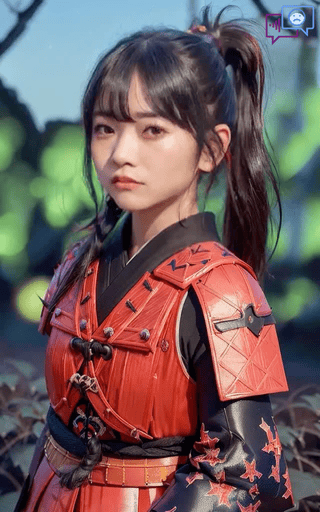
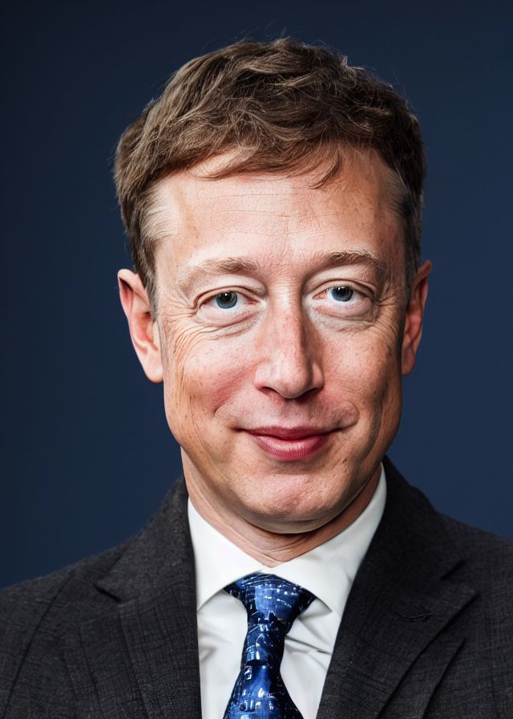

# 使用最佳实践和配置技巧

> 我们的模型仅适用于真人或与真人相似的人像图片。动漫人物说话头像生成方法将在未来发布。

`inference.py`高级配置选项：

| 名称        | 配置参数 | 默认值 |   说明  | 
|:------------- |:------------- |:----- | :------------- |
| 增强模式 | `--enhancer` | None | 使用 `gfpgan` 或 `RestoreFormer` 通过面部恢复网络增强生成的面部 |
| 背景增强器 | `--background_enhancer` | None | 使用 `realesrgan` 增强完整视频。 |
| 静止模式   | ` --still` | False |  使用与原始图像相同的姿态参数，减少头部运动。|
| 表情模式 | `--expression_scale` | 1.0 | 更大的数值会使表情动作更强烈。|
| 保存路径 | `--result_dir` |`./results` | 文件将保存在新位置。|
| 预处理 | `--preprocess` | `crop` | 在裁剪后的输入图像上运行并生成结果。其他选择：`resize`，将图像调整到特定分辨率。`full` 运行完整图像动画，与 `--still` 一起使用可获得更好的结果。|
| 参考模式（眼部） | `--ref_eyeblink` | None | 一个视频路径，我们从这个参考视频中借用眨眼动作来提供更自然的眉毛运动。|
| 参考模式（姿态） | `--ref_pose` | None | 一个视频路径，我们从这个头部参考视频中借用姿态。 |
| 3D模式 | `--face3dvis` | False | 需要额外安装。生成3D面部的更多详情可在[docs/face3d.md](face3d.md)中找到。 |
| 自由视角模式 | `--input_yaw`,<br> `--input_pitch`,<br> `--input_roll` | None | 从单张图像生成新视角或4D说话头像。更多详情可在[4D自由视角生成](#生成4d自由视角说话示例)中找到。


### 关于 `--preprocess`

我们的系统通过 `crop`、`resize` 和 `full` 模式自动处理输入图像。

在 `crop` 模式中，我们仅通过面部关键点生成裁剪后的图像，并生成面部动画头像。表情和头部姿态的动画都很真实。

> 静止模式将停止眨眼和头部姿态运动。

| [输入图像 @bagbag1815](https://twitter.com/bagbag1815/status/1642754319094108161) | crop | crop w/still |
|:--------------------: |:--------------------: | :----: |
|  |  |  |


在 `resize` 模式中，我们调整整个图像的尺寸来生成完整的说话头像视频。因此，可以生成类似证件照的图像。⚠️ 对于全身图像会产生不好的结果。

 |  |   |
|:--------------------: |:--------------------: |
| ❌ 不适合resize模式 | ✅ 适合resize模式 |
|  |   |

在 `full` 模式中，我们的模型将自动处理裁剪区域并粘贴回原始图像。记得使用 `--still` 来保持原始头部姿态。

| 输入 | `--still` | `--still` & `enhancer` |
|:--------------------: |:--------------------: | :--:|
|  |   |   


### 关于 `--enhancer`

为了获得更高的分辨率，我们集成了[gfpgan](https://github.com/TencentARC/GFPGAN)和[real-esrgan](https://github.com/xinntao/Real-ESRGAN)用于不同的目的。只需要添加 `--enhancer <gfpgan 或 RestoreFormer>` 或 `--background_enhancer <realesrgan>` 来增强面部和完整图像。

```bash
# 确保以下包可用：
pip install gfpgan
pip install realesrgan
```

### 关于 `--face3dvis`

这个标志表示我们可以生成3D渲染的面部及其3D面部关键点。更多详情可在[face3d.md](face3d.md)中找到。

| 输入        | 动画3D面部 | 
|:-------------: | :-------------: |
|   | <video src="https://user-images.githubusercontent.com/4397546/226856847-5a6a0a4d-a5ec-49e2-9b05-3206db65e8e3.mp4"></video>  | 

> 请确保激活音频，因为默认的音频播放与GitHub不兼容。

#### 参考眨眼模式

| 输入，带参考视频   ,  参考视频    | 
|:-------------: | 
|  | 
| 如果参考视频比输入音频短，我们将循环播放参考视频。 |

#### 生成4D自由视角说话示例

我们使用 `input_yaw`、`input_pitch`、`input_roll` 来控制头部姿态。例如，`--input_yaw -20 30 10` 意味着输入头部偏航角度从-20变化到30，然后从30变化到10。

```bash
python inference.py --driven_audio <audio.wav> \
                    --source_image <video.mp4 or picture.png> \
                    --result_dir <结果存储文件夹> \
                    --input_yaw -20 30 10
```

| 结果，自由视角结果，新视角结果  | 
|:-------------: | 
|  | 
